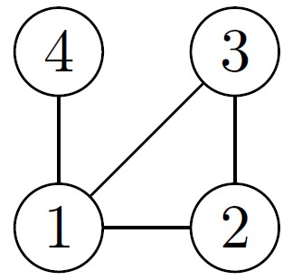
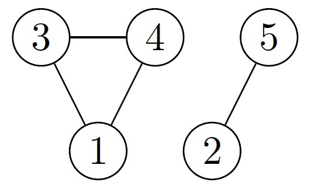

# Problem Introduction
You would like to compute the minimum number of flight segments to get from one city to another one. For
this, you construct the following undirected graph: vertices represent cities, there is an edge between two
vertices whenever there is a flight between the corresponding two cities. Then, it suffices to find a shortest
path from one of the given cities to the other one.

# Task
Given an undirected graph with 𝑛 vertices and 𝑚 edges and two vertices 𝑢 and 𝑣, compute the length
of a shortest path between 𝑢 and 𝑣 (that is, the minimum number of edges in a path from 𝑢 to 𝑣).

# Input Format
A graph is given in the standard format. The next line contains two vertices 𝑢 and 𝑣.

# Constraints
2 ≤ 𝑛 ≤ 105, 0 ≤ 𝑚 ≤ 105, 𝑢 ̸= 𝑣, 1 ≤ 𝑢, 𝑣 ≤ 𝑛.

# Output Format
Output the minimum number of edges in a path from 𝑢 to 𝑣, or −1 if there is no path.

# Sample 1
  Input: 
  4 4 
  1 2 
  4 1 
  2 3 
  3 1 
  2 4 
  Output: 
  2 
  

 
<strong>Explanation:</strong> 
There is a unique shortest path between vertices 2 and 4 in this graph: 2 − 1 − 4.

# Sample 2
  Input: 
  5 4 
  5 2 
  1 3 
  3 4 
  1 4 
  3 5 
  Output: 
  -1 
  

 
<strong>Explanation:</strong> 
There is no path between vertices 3 and 5 in this graph.
