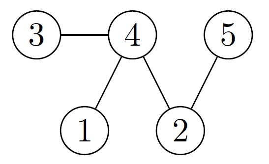

# Problem Introduction
An undirected graph is called bipartite if its vertices can be split into two parts such that each edge of the
graph joins to vertices from different parts. Bipartite graphs arise naturally in applications where a graph
is used to model connections between objects of two different types (say, boys and girls; or students and
dormitories).
An alternative definition is the following: a graph is bipartite if its vertices can be colored with two colors
(say, black and white) such that the endpoints of each edge have different colors.

# Task
Given an undirected graph with 𝑛 vertices and 𝑚 edges, check whether it is bipartite.

# Input Format
A graph is given in the standard format. The next line contains two vertices 𝑢 and 𝑣.

# Constraints
1 ≤ 𝑛 ≤ 105, 0 ≤ 𝑚 ≤ 105.

# Output Format
Output 1 if the graph is bipartite and 0 otherwise.

# Sample 1
  Input: 
  4 4 
  1 2 
  4 1 
  2 3 
  3 1 
  Output: 
  0 
  

 
<strong>Explanation:</strong> 
This graph is not bipartite. To see this assume that the vertex 1 is colored white.
Then the vertices 2 and 3 should be colored black since the graph contains the edges
{1, 2} and {1, 3}. But then the edge {2, 3} has both endpoints of the same color.

# Sample 2
  Input: 
  5 4 
  5 2 
  4 2 
  3 4 
  1 4 
  Output: 
  1 
  

 
<strong>Explanation:</strong> 
This graph is bipartite: assign the vertices 4 and 5 the white color, assign all the remaining vertices
the black color.
