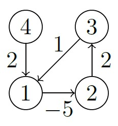

# Problem Introduction
You are given a list of currencies 𝑐1, 𝑐2, . . . , 𝑐𝑛 together with a list of exchange
rates: 𝑟𝑖𝑗 is the number of units of currency 𝑐𝑗 that one gets for one unit
of 𝑐𝑖. You would like to check whether it is possible to start with one unit
of some currency, perform a sequence of exchanges, and get more than one
unit of the same currency. In other words, you would like to find currencies
𝑐𝑖1 , 𝑐𝑖2 , . . . , 𝑐𝑖𝑘 such that 𝑟𝑖1,𝑖2 · 𝑟𝑖2,𝑖3 · 𝑟𝑖𝑘−1,𝑖𝑘 , 𝑟𝑖𝑘,𝑖1 > 1. For this, you construct
the following graph: vertices are currencies 𝑐1, 𝑐2, . . . , 𝑐𝑛, the weight of
an edge from 𝑐𝑖 to 𝑐𝑗 is equal to −log 𝑟𝑖𝑗 . There it suffices to check whether is
a negative cycle in this graph. Indeed, assume that a cycle 𝑐𝑖 → 𝑐𝑗 → 𝑐𝑘 → 𝑐𝑖
has negative weight. This means that −(log 𝑐𝑖𝑗 + log 𝑐𝑗𝑘 + log 𝑐𝑘𝑖) < 0 and
hence log 𝑐𝑖𝑗 + log 𝑐𝑗𝑘 + log 𝑐𝑘𝑖 > 0. This, in turn, means that
𝑟𝑖𝑗𝑟𝑗𝑘𝑟𝑘𝑖 = 2log 𝑐𝑖𝑗 2log 𝑐𝑗𝑘2log 𝑐𝑘𝑖 = 2log 𝑐𝑖𝑗+log 𝑐𝑗𝑘+log 𝑐𝑘𝑖 > 1.

# Task
Given an directed graph with possibly negative edge weights and with 𝑛 vertices and 𝑚 edges, check
whether it contains a cycle of negative weight.

# Input Format
A graph is given in the standard format.

# Constraints
≤ 𝑛 ≤ 103, 0 ≤ 𝑚 ≤ 104, edge weights are integers of absolute value at most 103.

# Output Format
Output 1 if the graph contains a cycle of negative weight and 0 otherwise.

# Sample 1
  Input: 
  4 4 
  1 2 -5 
  4 1 2 
  2 3 2 
  3 1 1 
  Output: 
  1 
  

 
<strong>Explanation:</strong> 
The weight of the cycle 1 → 2 → 3 is equal to −2, that is, negative.
