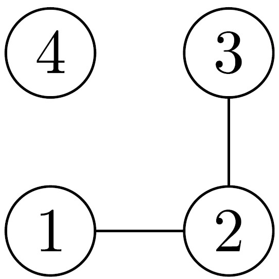

# Problem Introduction
Now you decide to make sure that there are no dead zones in a maze, that is, that at least one exit is reachable from each cell. For this, you find connected components of the corresponding undirected graph and ensure that each component contains an exit cell.

# Task
Given an undirected graph with 𝑛 vertices and 𝑚 edges, compute the number of connected components in it.

# Input Format
A graph is given in the standard format.

# Constraints
1 ≤ 𝑛 ≤ 10^3, 0 ≤ 𝑚 ≤ 10^3.

# Output Format
Output the number of connected components.

# Sample 1
  Input: 
  4 2 
  1 2 
  3 2 
  Output: 
  2 
  

 
 <strong>Explanation:</strong> 
There are two connected components here: {1, 2, 3} and {4}.
