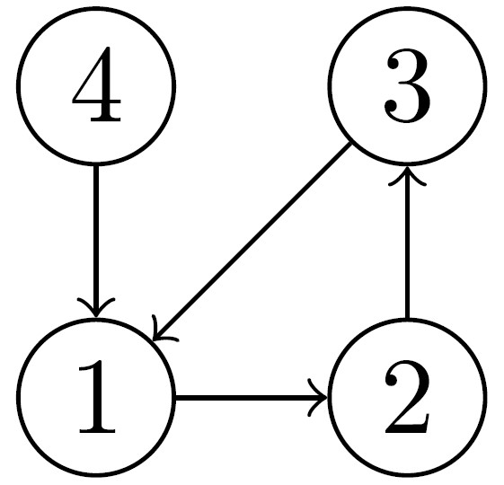

# Problem Introduction
The police department of a city has made all streets one-way. You would like
to check whether it is still possible to drive legally from any intersection to
any other intersection. For this, you construct a directed graph: vertices are
intersections, there is an edge (𝑢, 𝑣) whenever there is a (one-way) street from
𝑢 to 𝑣 in the city. Then, it suffices to check whether all the vertices in the
graph lie in the same strongly connected component.

# Task
Compute the number of strongly connected components of a given directed graph with 𝑛 vertices and
𝑚 edges.

# Input Format
A graph is given in the standard format.

# Constraints
1 ≤ 𝑛 ≤ 104, 0 ≤ 𝑚 ≤ 104.

# Output Format
Output the number of strongly connected components.

# Sample 1
  Input: 
  4 4 
  1 2 
  4 1 
  2 3 
  3 1 
  Output: 
  2 
  

 
 <strong>Explanation:</strong> 
This graph has two strongly connected components: {1, 3, 2}, {4}.
